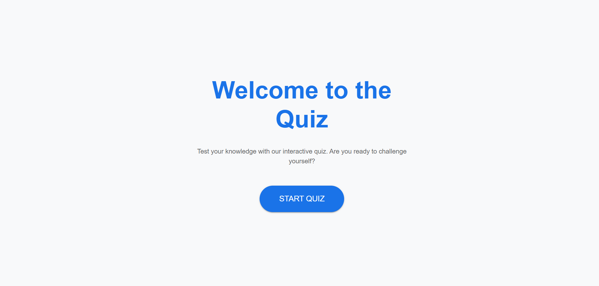
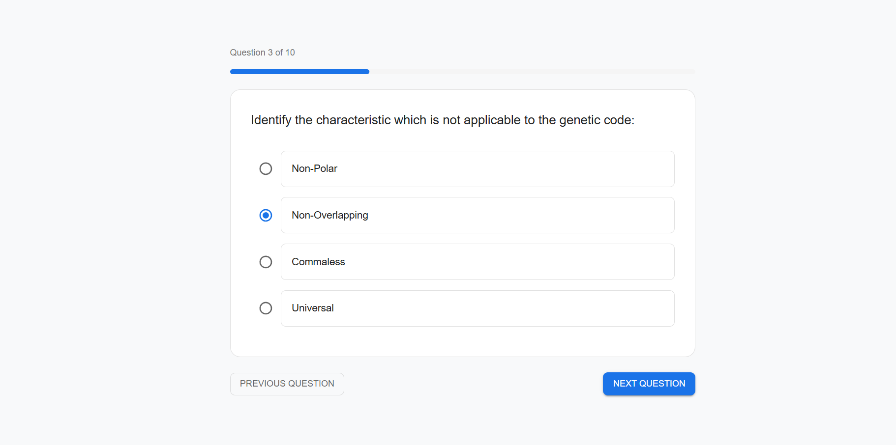
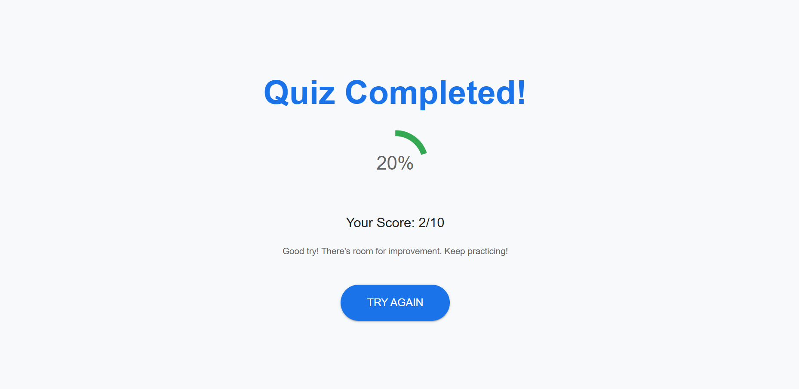

# Quiz Application with Gamification

## Project Overview

This project is a web-based quiz application that integrates gamification features. The application fetches quiz data from a provided API endpoint and presents it through an engaging and interactive user interface. The application has multiple-choice questions, a start button, and shows a summary of results upon quiz completion, including the total points scored. Gamification features have been added to enhance the user experience.

### Features:

- Start the quiz
- Display multiple-choice questions
- Results summary at the end of the quiz showing the total score

---

## Setup Instructions

To run the project locally, follow the steps below:

### Prerequisites:

- Node.js (v14 or higher)
- npm (or yarn)

### Steps:

1. Clone the repository:

   ```bash
   git clone https://github.com/swarajmahadik123/quiz-app.git
   ```

2. Navigate to the project directory:

   ```bash
   cd client
   ```

3. Install dependencies:

   ```bash
   npm install
   ```

4. Start the development server:

   ```bash
   npm start
   ```

5. Open the app in your browser:
   Go to `http://localhost:3000` to view the app.

---

## Data Integration

The quiz data is fetched from the following API endpoint:

- `https://api.jsonserve.com/Uw5CrX`

The application parses the data and handles errors to ensure smooth operation. It displays questions and multiple-choice answers and processes user input accordingly.

---

## Screenshots

Here are some screenshots showcasing the application in action:


_Start Screen_


_Question Screen_


_Results Summary_

---

## Video Walkthrough

Here’s a short video walkthrough of the app in action:

[Watch the demo video here](./client/src/assets/videos/quiz-app-demo.mp4)

---

## Technologies Used:

- **React** (JavaScript Framework)
- **CSS** (Styling)
- **Axios** (For data fetching)
- **React Router** (For navigation)

---

## Evaluation Criteria:

- **Data Integration**: Successfully fetched and displayed quiz data from the provided API.
- **User Interface**: Clean, intuitive, and visually engaging UI.
- **User Experience**: Smooth interactivity with minimal load times.
- **Code Quality**: Well-documented and maintainable code.
- **Bonus**: Gamification elements to enhance user experience.

---

---

## Acknowledgements:

- **Testline App** for design inspiration.
- **React** for building the app framework.
- **Axios** for API data fetching.

---

## Repository Link

You can find the full source code for the project in the GitHub repository:  
[GitHub Repository](https://github.com/swarajmahadik123/quiz-app)
